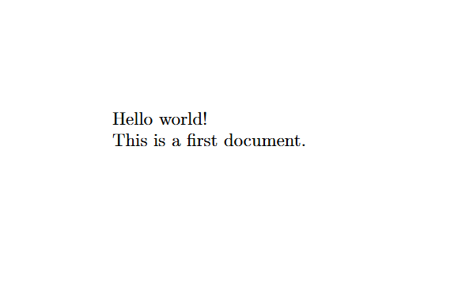

# Лабораторная работа №1

**Установка Tex Live и первый комент LaTex**

Выполнил: Лобов Михаил Сергеевич

---

## Цель работы 

1. Установить TexLive на рабочую систему
2. Проверить корректность установки 
3. Создать минимальный LaTex документ и скомпилировать его в pdf
4. Зафиксировать шаги выполнения (команды, результаты компиляции, артефакты)
5. Подготовить отчет и презентацию по проделанной работе

---

## Задание


1. Установка TeX Live (Windows)
2. Проверка компилятора `pdflatex`
3. Создание `main.tex` с минимальной структурой
4. Компиляция в `main.pdf`
5. Подготовка отчета и презентации, публикация в репозитории

---

## Теория LaTex

- Документ создается как текс с разметкой (командами)
- Итоговый pdf получается после компиляции
- При ссылках/оглавлении/цитированиях необходимы повторные прогоны компиляции
- Распространенные движки: `pdfTex`, `XeTex`, `LuaTex`

---

## Tex Live

- Tex Live - полный дистрибутив Latex
- В Windows установка происходит с помощью powershell от имени администратора и пакета choco
- После установки можно начинать созадавать первый фал и компилировать документ

---

## Ход работы

1. Установка choco
2. Запуск powershell от имени администратора
3. Установка TeX Live:

```powershell
choco install texlive
```

---

## Пример разметки

```latex
\documentclass{article}
\usepackage[T1]{fontenc}

\begin{document}
Hello world!

This is a first document.
\end{document}
```

---

## Компиляция документа 1/2

```powershell
pdflatex main.tex
```



---

## Компиляция документа 2/2

После успешной компиляции у нас появятся файлы:
- main.pdf
- main.aux
- main.log

---

## Выводы

**TeX Live** установлен и работает

`pdflatex` успешно собирает документ в PDF

Освоены базовые артефакты сборки (.pdf, .aux, .log)

Подготовлены материалы для дальнейших лабораторных работ