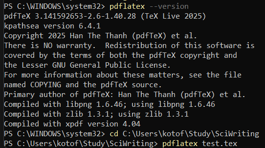

---
## Front matter
title: "Отчет по лабораторной работе №1 по предмету Practical scientific writing"
author: "Лобов Михаил Сергеевич"

## Generic options
lang: ru-RU
toc-title: "Содержание"

## Bibliography
bibliography: bib/cite.bib
csl: pandoc/csl/gost-r-7-0-5-2008-numeric.csl

## Pdf output format
toc: true
toc-depth: 2
lof: true
lot: true
fontsize: 12pt
linestretch: 1.5
papersize: a4
documentclass: scrreprt

## I18n polyglossia
polyglossia-lang:
  name: russian
  options:
    - spelling=modern
    - babelshorthands=true
polyglossia-otherlangs:
  name: english

## I18n babel
babel-lang: russian
babel-otherlangs: english

## Fonts
mainfont: IBM Plex Serif
romanfont: IBM Plex Serif
sansfont: IBM Plex Sans
monofont: IBM Plex Mono
mathfont: STIX Two Math
mainfontoptions: Ligatures=Common,Ligatures=TeX,Scale=0.94
romanfontoptions: Ligatures=Common,Ligatures=TeX,Scale=0.94
sansfontoptions: Ligatures=Common,Ligatures=TeX,Scale=MatchLowercase,Scale=0.94
monofontoptions: Scale=MatchLowercase,Scale=0.94,FakeStretch=0.9
mathfontoptions:

## Biblatex
biblatex: true
biblio-style: "gost-numeric"
biblatexoptions:
  - parentracker=true
  - backend=biber
  - hyperref=auto
  - language=auto
  - autolang=other*
  - citestyle=gost-numeric

## Pandoc-crossref LaTeX customization
figureTitle: "Рис."
tableTitle: "Таблица"
listingTitle: "Листинг"
lofTitle: "Список иллюстраций"
lotTitle: "Список таблиц"
lolTitle: "Листинги"

## Misc options
indent: true
header-includes:
  - \usepackage{indentfirst}
  - \usepackage{float}
  - \floatplacement{figure}{H}
---


# Цель работы 

Настроить локальную среду для работы с LaTex, установить дистрибутив TexLive и проверить его работоспособность (компиляцию pdflatex). Необходимо собрать минималистичные Tex документ и скомпилировать его в pdf.

# Задание 

1. Установить TexLive на рабочую систему
2. Проверить корректность установки 
3. Создать минимальный LaTex документ и скомпилировать его в pdf
4. Зафиксировать шаги выполнения (команды, результаты компиляции, артефакты)
5. Подготовить отчет и презентацию по проделанной работе

# Теоретическое введение

LaTex - это система компьютерной вёрстки, в которой документ создаётся как исходный текст с разметкой. В отличие от текстовых редакторов WYSIWYG, пользователь описывает структуру документа командами (например, `\section` для разделов), а итоговый PDF получается после компиляции.

Рабочий процесс включает: 
- написание исходника .tex
- запуск компилятора и получение pdf
- при наличии ссылок/оглавления/цитирований может понадобиться несколько прогонов компиляции

TeX Live — один из наиболее полных и распространённых дистрибутивов LaTeX, доступный для разных ОС. В Windows удобный способ установки — через менеджер пакетов Chocolatey.

# Выполнение лабораторной работы

## 0.

Установка Chocolatey для удобной загрузки пакетов через powershell.

## 1. Подготовка среды

Открытие windows powershell от имени администратора.

## 2. Установка TexLive

Установка выполнена через Chocolatey:

```powershell
choco install texlive
```

## 3. Проверка установки

```powershell
pdflatex --version
```

## 4. Создание документа

```Latex
\documentclass{article}
\usepackage[T1]{fontenc}

\begin{document}
Hello world!

This is a first document.
\end{document}
```

## 5. Компиляция документа 

```powershell
pdflatex main.tex
```

После успешной компиляции у нас появятся файлы:
- main.pdf
- main.aux
- main.log

## 6. Результат компиляции 



# Формирование отчета и презентации

- Подготовлен отчет в markdown по шаблону.
- Отчет конвертируется в docx и pdf с использованием pandoc
- Подготовка презентации marp и экспорт ее в pdf
- Защита презентации и публикация скринкастов
- Материалы размещаются в репозитории

# Выводы
В ходе работы была установлена и проверена система TexLive, освоена базовая структура Latex докумнета и выполнена компиляция исходного файла в pdf. Подготовлена основа для дальнейших лабораторных работ.

# Список литературы

# Приложение ссылки на скринкасты и репозиторий

