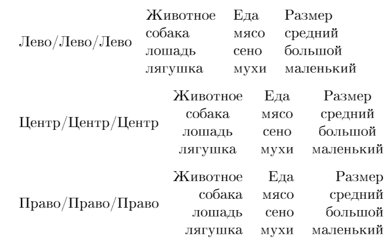

# Лабораторная работа №5

## Таблицы в $LaTex$ (array,booktabs,multicolumn)

---

# Цель работы 

- Научиться создавать таблицы в окружении `tabular`

- Проверить выравнивание столбцов: `l`, `c`, `r`

- Изучить поведение при “нехватке” и “избытке” ячеек в строке

- Освоить `\multicolumn` и настройку столбцов через пакет `array`

- Улучшить оформление таблиц с помощью `booktabs`

---

# Задание 

1. Использовать простой пример таблицы и начать экспериментировать с табличной разметкой.

2. Проверить разные выравнивания столбцов с помощью `l`, `c`, `r`.

3. Проверить, что происходит, если в строке таблицы **меньше элементов**, чем описано в преамбуле.

4. Проверить, что происходит, если в строке таблицы **больше элементов**, чем описано в преамбуле.

5. Поэкспериментировать с `\multicolumn` для объединения ячеек по горизонтали и с настройкой форматирования столбцов через пакет `array`.

---

# Выполнение лабораторной работы

## Базовая таблица 

Окружение `tabular`, 3 стоблца и 3 строки, не считая заголовка

```latex
\begin{tabular}{lll}

Животное & Еда  & Размер \\

собака   & мясо & средний \\

лошадь   & сено & большой \\

лягушка  & мухи & маленький \\

\end{tabular}
```

---


---
---

# Выравнивание столбцов: l/r/c

Три варианта преамбулы таблицы:

* `lll` — по левому краю

* `ccc` — по центру

* `rrr` — по правому краю

**Наблюдение:** меняется только выравнивание, структура таблицы остаётся той же.

---

---

---
# Случай, если в строке мало элементов
Если объявлено (3) столбца, а в строке (2) ячейки — недостающая ячейка остаётся пустой:
```latex
\begin{tabular}{lll}
Животное & Еда  & Размер \\
лошадь   & сено \\       
\end{tabular}
```


---
# Случай, если в строке слишком много элементов

Если в строке (4) ячейки при (3) столбцах — будет ошибка выравнивания

(часто: *Extra alignment tab has been changed to \textbackslash cr*):

```latex
\begin{tabular}{lll}
Животное & Еда  & Размер \\
собака   & мясо & средний & ЛИШНЕЕ \\ % 4 ячейки вместо 3
лошадь   & сено & большой \\
\end{tabular}
```

---
# `\multicolumn` объединение ячеек
2 Последние ячейки столбца мы объединяем в одну. 
```latex
\begin{tabular}{lll}
\toprule
Животное & Еда  & Размер \\
\midrule
собака   & мясо & средний \\
лошадь   & сено & большой \\
лягушка  &\multicolumn{2}{c}{неизвестно} \\
\bottomrule
\end{tabular}
```

---
# Пакет array: формирование столбцов
Задаем стиль первого столбца: 
```latex

\begin{tabular}{>{\itshape}l<{:}ll}

```
Эффект:

* первый столбец — *курсивом*

* после значения первого столбца добавляется `:`

---
# Снятие стиля у заголовка столбца
Чтобы заголовок не был курсивом и без двоеточия — используем `\multicolumn`:

```latex
\multicolumn{1}{l}{Животное} & Еда & Размер \\

```

**Практическое применение:** `\multicolumn{1}{...}{...}` может переопределить оформление конкретной ячейки.

---
# booktabs: аккуратные линии таблицы

```latex
\begin{tabular}{>{\itshape}l<{:}ll}
\toprule
\multicolumn{1}{l}{Животное} & Еда & Размер \\
\midrule
собака   & мясо & средний \\
лошадь   & сено & большой \\
лягушка  & мухи & маленький \\
\bottomrule
\end{tabular}
```
**Плюс:** типографски правильный вид (обычно без вертикальных линий).

---
# Итоги работы 
* Освоено окружение `tabular` и выравнивания `l/c/r`

* Проверено поведение при:

  * недостатке ячеек (пустые поля)

  * избытке ячеек (ошибка компиляции)
* Применены:

  * `\multicolumn` для объединений

  * `array` для настройки столбцов

  * `booktabs` для улучшения оформления

---
# Выводы 

LaTeX требует строгого соответствия структуры таблицы (число `&`) заявленному числу столбцов.
Комбинация `array` + `\multicolumn` позволяет гибко управлять стилями и объединениями, а `booktabs` заметно улучшает внешний вид таблиц.

---

