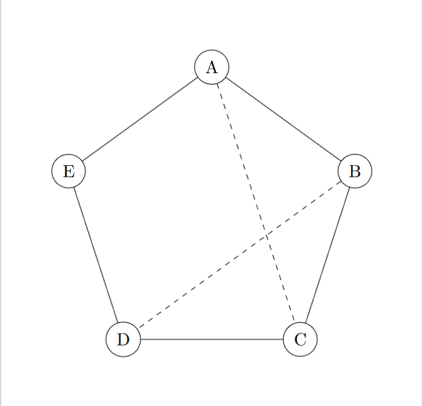
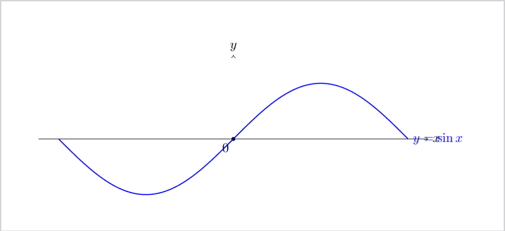
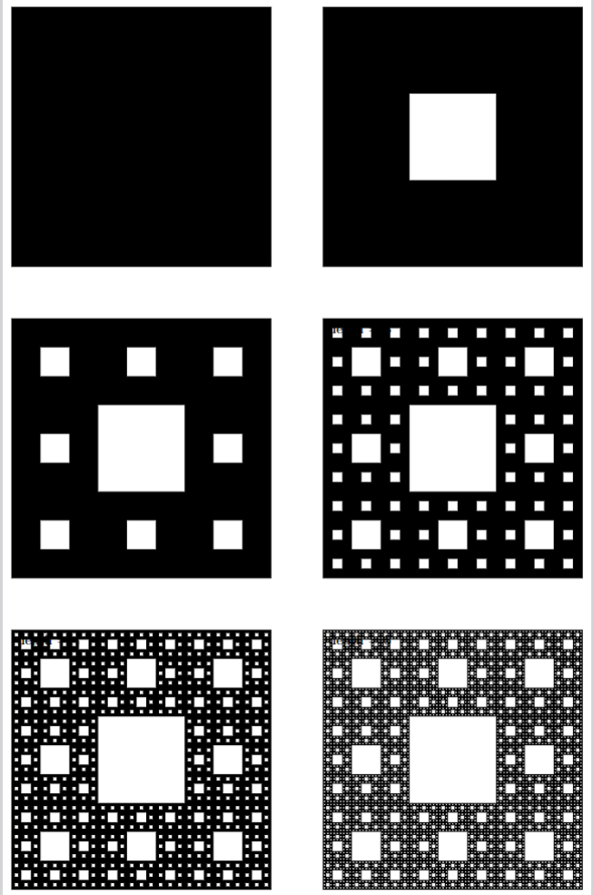

---
## Front matter
lang: ru-RU
title: Презентация лабораторной работы №1
subtitle: Простейший шаблон
author:
  - Лобов М. С.
institute:
  - Российский университет дружбы народов, Москва, Россия
date: 26 января 2026

## i18n babel
babel-lang: russian
babel-otherlangs: english

## Formatting pdf
toc: false
toc-title: Содержание
slide_level: 2
aspectratio: 169
section-titles: true
theme: metropolis
mainfont: "Times New Roman"
sansfont: "Arial"
monofont: "Consolas"
header-includes:
 - \usepackage{bm}
 - \metroset{progressbar=frametitle,sectionpage=progressbar,numbering=fraction}
 - '\makeatletter'
 - '\beamer@ignorenonframefalse'
 - '\makeatother'
---

# Лабораторная работа №8

## Диаграммы и рисунки TikZ в LaTex

**Цель**: освоить базовые приемы приемы TikZ для создания графиков.

---

# Задачи работы

Подключить пакет TikZ, использовать класс standalone для отдельных рисунков.
Выполненые следующие визуализации:
1. Граф из 5 вершин
2. График $y = \sin x$ 
3. Ковер Серпинского

*Для каждого рисунка сгенерированы PDF* 

---

# Инструменты и окружение

Пакет: `tikz`
Компиляция: `pdflatex` 
Отдельные рисунки: `\documentclass[border=...]{standalone}`

---
# Граф (1/3)

Граф построен в полярных координатах по окружности.
Задаем координаты:
```latex
\node[circle,draw] (A) at (90:\r) {A};
\node[circle,draw] (B) at (18:\r) {B};
\node[circle,draw] (C) at (-54:\r) {C};% узлы по окружности
\node[circle,draw] (D) at (-126:\r) {D};
\node[circle,draw] (E) at (162:\r) {E};
```

---
# Граф (2/3)
Задаем ребра и строим диагонали

\draw (A) -- (B);
\draw (B) -- (C);
\draw (C) -- (D);% рёбра
\draw (D) -- (E);
\draw (E) -- (A);

\draw[dashed] (A) -- (C);% диагонали
\draw[dashed] (B) -- (D);


--- 


--- 
# График функции $y=\sin x$
```latex
\draw[->] (-3.5,0) -- (3.5,0) node[right] {$x$};

\draw[->] (0,-1.5) -- (0,1.5) node[above] {$y$};

  

\draw[domain=-3.14:3.14, samples=200]

  plot (\x, {sin(\x r)})

  node[right] {$y=\sin x$};
```

---
# Замечания по построению графика

* Параметры `domain` и `samples` управляют диапазоном и гладкостью кривой.

* Суффикс `r` в `sin(\x r)` означает, что (\x) интерпретируется в радианах.

* Подписи добавляются обычными `node[...] { ... }` прямо на пути.

---


---
# Ковер Серпинского

Особенность LaTex такова, что рисовать каждый квадрат - переполнит память. Поэтому в упражнении использована рекурсия, так что квадраты на следующих итерациях просто копия квадратов на предыдущих итерациях.

---


---
# Код для создания рекурсии и оптимизации
```latex
    \foreach \ii in {0,1,2}{%
      \foreach \jj in {0,1,2}{% 
        \ifnum\ii=1\relax
          \ifnum\jj=1\relax
        \else
            \pgfmathsetmacro{\nx}{#1 + \ii*\s}
            \pgfmathsetmacro{\ny}{#2 + \jj*\s}
            \carpetholes{\nx}{\ny}{\s}{\numexpr#4-1\relax}%
          \fi
        \else
          \pgfmathsetmacro{\nx}{#1 + \ii*\s}
          \pgfmathsetmacro{\ny}{#2 + \jj*\s}
          \carpetholes{\nx}{\ny}{\s}{\numexpr#4-1\relax}%
```

---
# Компиляция и проверка
Сборка PDF файлов. Один прогон компиляции, но 3 отдельных файла под каждый график. 
```powershell
pdflatex main8.1.tex
pdflatex main8.2.tex
pdflatex main8.3.tex
```

---
# Результаты работы 

**Подготовлено:** 

* Исходники презентаций main8.1.tex/main8.2.tex/main8.3.tex
* Скомпилированные pdf файлы с изображениями графиков
* Отчет и презентация markdown 
* Видеоотчеты о проделанной работе

---
# Итоги

* Tikz позволяет строить схемы и графики программно, включая их прямо в текст документа при компиляции .tex файла
* Полярные координаты удобны для построения сложных многоугольников и графов 
* `plot` с `domain/samples` позволяет быстро рисовать функции
* Для построения фракталов необходимо использовать оптимизацию (а именно рекурсию)

---
# Приложения

## Источники и ссылки

  

* Документация LaTeX Project

* D. Tse, P. Viswanath — *Fundamentals of Wireless Communication*

* A. Goldsmith — *Wireless Communications*

  

**Репозиторий:** [https://github.com/PepsiMonster/SciWriting/tree/main/ex7](https://github.com/PepsiMonster/SciWriting/tree/main/ex8)